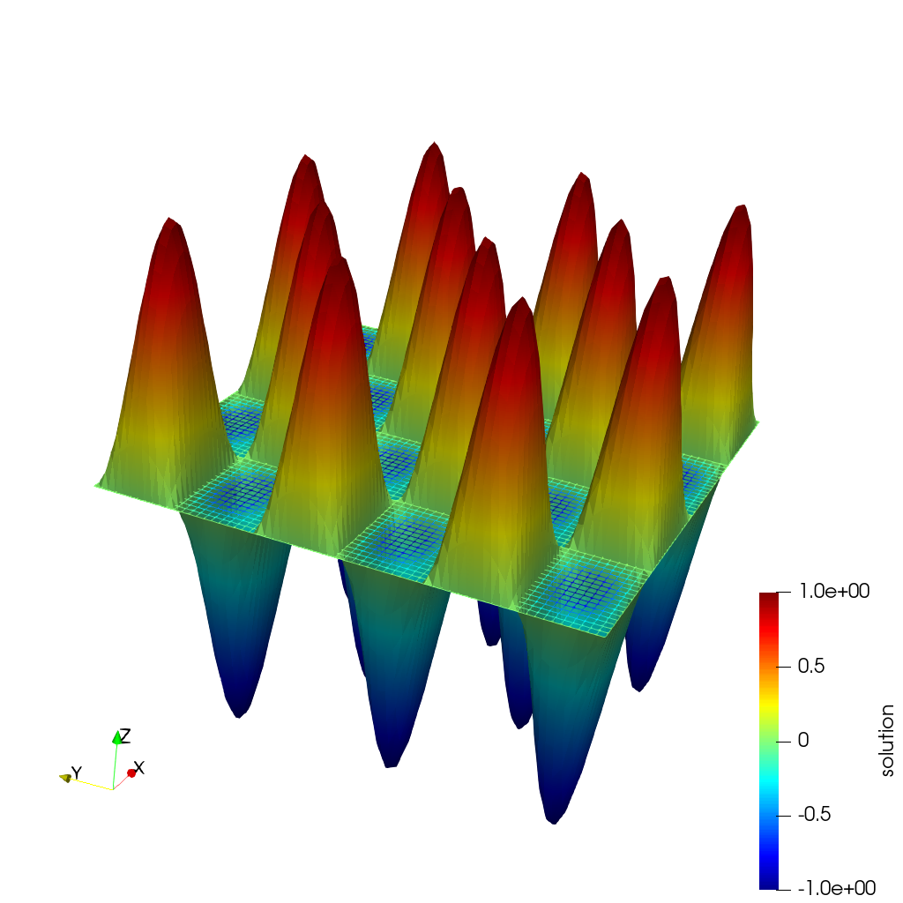
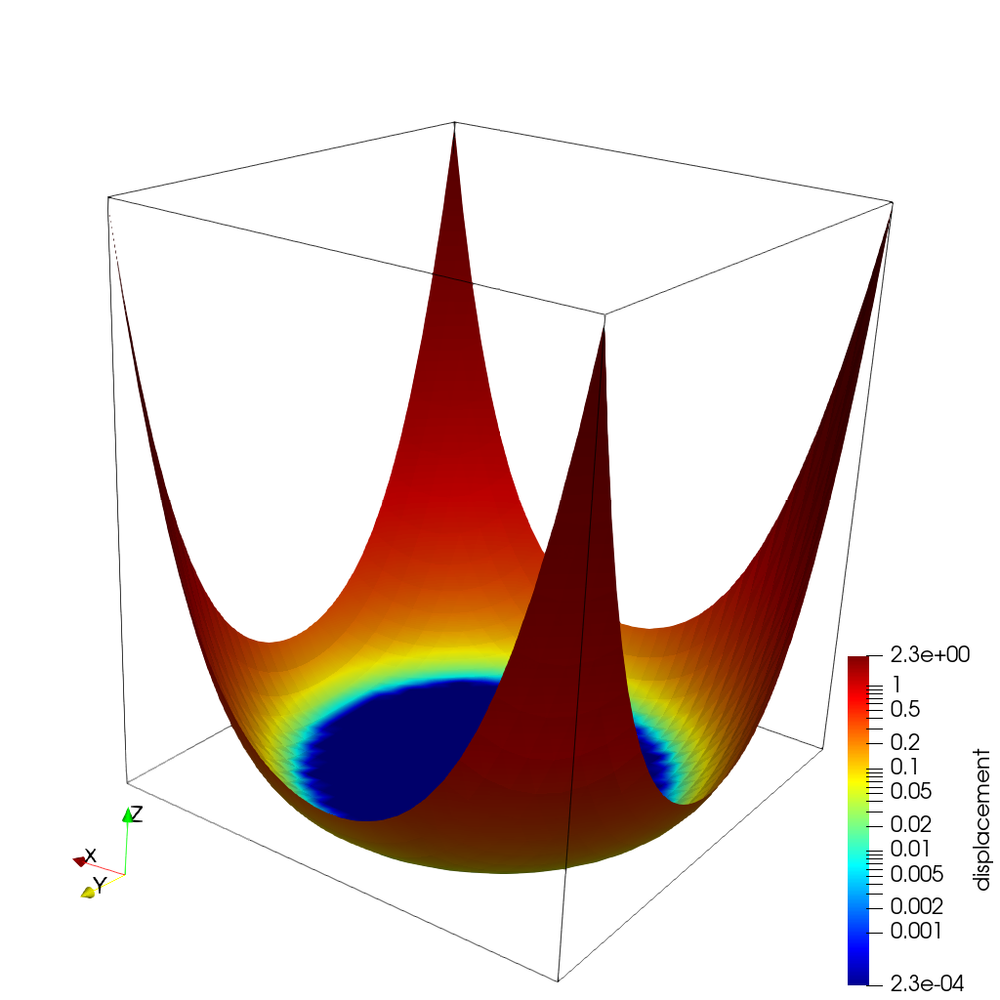

# Isogeometric Analysis with Deal.II 

https://github.com/raulinve/Isogeometric-Analysis-with-Deal.II  

:octocat:  :electron:  RI

[](https://github.com/raulinve/Isogeometric-Analysis-with-Deal.II)
[](https://github.com/raulinve/Isogeometric-Analysis-with-Deal.II)  

Isogeometric Analysis classes for the [deal.II library](https://www.dealii.org/).  

This repository contains C++ code and examples used to introduce the **Isogeometric Analysis** (IGA) framework into the standard **deal.II** C++ Finite Element (FE) library.  

**Download the full Project Report** \[[📥](https://drive.google.com/drive/folders/1tqF6Vt-ndLcSYb4ElotqxUrJOwSOpT8f?usp=sharing)\]:  
\[NOTE: Report set on PRIVATE from Sep-2021]  
[](https://drive.google.com/drive/folders/1tqF6Vt-ndLcSYb4ElotqxUrJOwSOpT8f?usp=sharing)  


**NOTE:** THIS PROJECT IS CURRENTLY **DISCONTINUED** AND NO MORE ACTIVELY MAINTAINED BY THE AUTHOR \[SEP-2021].


<br/>  

**Table of contents:**
- [🗃️ Organization of files and folders](#organization)  
- [🆕 Major updates](#major-updates)  
- [ℹ️ How to use](#usage)  
    - [🔤 Compilation and execution \[EASY START\]](#easy-compilation)  
    - [:triangular_flag_on_post: Single-file examples (*poisson*, *plate*, *beam*)](#poisson)  
    - [:triangular_flag_on_post: "iga_handler" examples (*membrane*, *\*_HPK*)](#obstacle)  
- [🛠️ Installation](#installation)  
- [📄 Documentation](#documentation)  
- [↘️ Code output](#output)  
- [✍️ Contributors and motivation](#contributions)  
- [©️ License](#license)  


<br/>  

<a name="organization"></a>
### 🗃️ Organization of files and folders:

- 📄 [*README.md*](./README.md) : \***this file**\*.  
- 📁 [*examples*](./examples) : **main folder** containing the working examples:  
    - 📁 [*01-Poisson*](./examples/01-Poisson) : contains a IGA modification of *step-4* of the deal.II library.  
    - 📂 [*01-Poisson_HPK*](./examples/01-Poisson_HPK) : \[🛠️\] contains a modification of the previous code, using `iga_handler` class.  
    - 📁 [*02-Poisson_extended*](./examples/02-Poisson_extended) : contains a IGA modification of *step-5* of the deal.II library.  
    - 📁 [*03-Elastic_plate*](./examples/03-Elastic_plate) : contains a IGA modification of *step-8* of the deal.II library.  
    - 📁 [*04-Elastic_beam*](./examples/04-Elastic_beam) : contains an IGA example of an elastic beam subjected to forces (similar to the *step-8*).  
    - 📂 [*04-Elastic_beam_HPK*](./examples/04-Elastic_beam_HPK) : \[🛠️\] contains a modification of the previous code, using `iga_handler` class.  
    - 📁 [*05-Elastic_membrane*](./examples/05-Elastic_membrane) : contains a IGA modification of *step-41* of the deal.II library.  
- 📁 [*references*](./references) : contains only a reference copy of the deal.II step examples used for this project.  
- 📁 [*scripts*](./scripts) : contains scripts used for automatic code indentation.  
- 📄 [*LICENSE*](./LICENSE) : contains the license of use provided with this code.  

<br/>  


---
<a name="major-updates"></a>
### 🆕 Major updates:
Last update: 📅 **SEP-2021**  

#### Project history visualization:  

[](https://www.youtube.com/watch?v=EJ23odrdBDk)  
Open the video \[[LINK](https://www.youtube.com/watch?v=EJ23odrdBDk)\] to **visually see how the project is changed** from the beginning to the actual state!  

From newest to oldest:  
* Note: 🔐 Project set on "**INDEFINITE PAUSE**" state. 
* Note: 📝 Added **download report** button, finalized all the documentation.
* Note: ➕ Adding distributed forces functionality in the beam code.
* Note: ➕ Expanding the beam code with h-p-k refinements possibility. \[on progress]
* Note: ➕ Expanding the poisson code with h-p-k refinements possibility.
* Note: 📁 Added a new **beam example** (with a structure resembling the deal.II step-8).  
* Note: 📁 Added a new example on an elastic problem, based on the deal.II **step-8**.  
* Note: 📁 Added a new example based on the deal.II **step-5**.  
* Note: 📝 Added **documentation** (Doxygen, Readme files, Images).
* Obstacle example: :heavy_check_mark: Improved (*Reorganization of the code, improved user interaction*).
* **Obstacle example**: :heavy_check_mark: Fixed  (*The code now compiles without errors or warnings with deal.II 9.2.0*).
* Poisson example: :heavy_check_mark: Improved (*Reorganization of the code, improved user interaction*).
* **Poisson example**: :heavy_check_mark: Fixed  (*The code now compiles without errors or warnings with deal.II 9.2.0*).
* Note: ♻️ A previous version of this repository has been completely deleted and substituted with this new one.  


<br/>  


---
<a name="usage"></a>
### ℹ️ How to use:

Note: :warning: The code is intended to be **executed on a Linux system** only (it has been tested under **Ubuntu 20.04 LTS**).  

Every folder is equipped with two files that simplify the compilation of the code:
* "*COMPILE.sh*"  (it is a script that contains some simple lines of code used to start the compilation process)  
* "*CMakeLists.txt*"  (it contains a set of directives and instructions describing the project's source files and targets)  

<br/>  

<a name="easy-compilation"></a>
**🔤 Compilation and execution [EASY START]:**  
Open the terminal in the folder containing the "*COMPILE.sh*" file and execute it using the command:  
```
./COMPILE.sh
```  

**Note:** Before executing the "*COMPILE.sh*" script, check it is executable (if it is not, change its state using: $`chmod +x COMPILE.sh`). 

**Note:** The default deal.II path used in the script is the one that makes use of the PoliMi mkModules (see the [Installation](#installation) section). If you use a standard version of deal.II or have a custom installation, please modify the PATH contained in the "*COMPILE.sh*" after the tag "DDEAL_II_DIR" before running it. Note that several folders path are already included as comments in all "*COMPILE.sh*" files.  

<br/>  

🤓 **If you prefer to compile the code manually use the following procedure:**  
1. Open the terminal in the selected example folder ad use these commands:
   ```
   mkdir build  
   cd build  
   cmake .. -DDEAL_II_DIR=/path/to/dealii/installation  
   make  
   ```
   **Note:** The default installation folder of the deal.II library should be: `/path/to/dealii/installation`=`/usr/include/deal.II/`.  
2. If everything went well, you should have an executable (named `poisson` or `exe` ...) in the newly created *build* directory.  
3. At this point, if you want to **recompile** the code after some changes to the source code, it is not needed to repeat all the operations here listed, but it is only sufficient to open the terminal into the *build* directory and use the command $`make`.  


<br/>  

<a name="poisson"></a>
### :triangular_flag_on_post: Single-file examples (*poisson*, *plate*, *beam*):

  

**Img. 1**: Result plot of the *poisson* code.  

The "single-file" examples are characterized by having a single *"FILE_NAME.cc"* file, contained directly into the example folder.  
Example: * "poisson.cc", \"*step-8.cc*\", ...  

#### 👉 Instructions to **execute** the codes:  

The executable takes \[0] OR \[5] arguments to run, respectively:
```
./FILE_NAME
```  
Example: ` ./poisson `  

OR
```
./FILE_NAME  FE_TYPE  QUADRATURE  DEG  CYCLE_START  CYCLE_STOP
```
The accepted arguments are:

* FE_TYPE:
 	* `bernstein`  [default]
 	* `lagrange`
 	* `lobatto`
* QUADRATURE:
 	* `legendre`   [default]
 	* `lobatto`
* DEG:         (es: ` 1 `) degree of the finite element space
* CYCLE_START: (es: ` 0 `) initial refinement of the grid
* CYCLE_STOP:  (es: ` 5 `) final refinement of the grid  

Example: ` ./poisson bernstein legendre 1 0 5 `


<br/>  

<a name="obstacle"></a>
### :triangular_flag_on_post: Iga_handler examples (*membrane*, *\*_HPK*):

  

**Img. 2**: Result plot of the *obstacle* code.  

The codes of this type consist of a series of files included in two folders:  
* "*source*" directory (containing all the *"\*.cc"* source files);  
* "*include*" directory (containing all the *"\*.h"* header files).  

#### 👉 Instructions to **execute** the code:

The executable takes no arguments. To run, go to the "build" folder, and use the following command:
```
./FILE_NAME
```
Example: ` ./exe `  


<br/>  

---
<a name="installation"></a>
### 🛠️ Installation:

Note: The codes have been tested under a clean installation of Xubuntu, version **20.04 LTS**.  
Note: The codes have been tested using the **deal.II version 9.2.0** (and *9.1.1-9 build2*).  
Note: The original code required **deal.II version 8.3** to work properly, in the code you can find some suggestions in order to make the actual code compilable with that version but remember it is not tested, so please consider upgrading to version 9.2.0.  


In order to setup the environment, follow the following steps:  

<br/>  

#### ⚙️ \[A\] Easy installation procedure (using the Linux Advanced Packaging Tool):

1. Install a C++ compiler:  
   $ `gcc -v`                     check the installed version of gcc (9.3.0)  
   $ `clang -v`                   check the installed version of clang (10.0.0)  
   $ `sudo apt install gcc`       install the last version of gcc  
   $ `sudo apt install clang`     install the last version of clang  

2. Update all packages before starting the deal.II installation procedure:  
   $ `sudo apt-get update`  

3. Install the deal.II library:  
   $ `sudo apt-get install libdeal.ii-dev`  
  Note: This command will install the main deal.II library, along with all its suggested additional packages:   
  (es: *boost, fftw3, superlu, trilinos, open mpi, muparser, occt, ...* )  
  The required space is about ~ 2 GB for all.  

**Uninstall the library:**
1. Uninstall the main library:  
   $ `sudo apt-get --purge remove libdeal.ii-dev`
   
2. Remove automatically installed packages which are no longer required:  
   $ `sudo apt-get autoremove`

3. \[*usually NOT needed*\] If you need to manually remove directories or files, please use:   
   $ `sudo rm FILENAME`           manually remove a file  
   $ `sudo rm -r ./FOLDERNAME`    manually remove a folder and all its content  

<br/>  

#### ⚙️ \[B\] PoliMi installation procedure (using a shared mk-modules archive) :  
Note: This installation procedure is suggested for [Politecnico di Milano](https://www.polimi.it/en/) staff members and students.

1. Download the archive containing the library and a lot of other tools used by the PoliMi [MOX](https://mox.polimi.it/) Lab:  
   https://github.com/elauksap/mk/releases/download/v2020.1/mk-2020.1-lifex.tar.gz
   
2. Extract the archive with the command:  
   $ `sudo tar xvzf mk-2020.1-lifex.tar.gz -C /`
   
3. In order to load all modules on each time a terminal is open, add the following two lines at the end of the system file "*~/.bashrc*":  
   `source /u/sw/etc/profile`  
   `module load gcc-glibc/9 dealii`  
   Note: Reboot the terminal (close and open again the terminal window) in order to activate the updates.   

**Uninstall the library:**
1. Remove the two added lines from the "*~/.bashrc*" file;  
   This should be enough to disable all modules from loading, leaving the system as if no modules were installed.  
   
2. Remove all modules, using the command:  
   $ `module purge`  

<br/>  

#### ⚙️ \[C\] Manual installation procedure (downloading and compiling the library source code):  
1. Go to the deal.II official website at https://www.dealii.org/download.html and download the most recent archive;  
   Note: The most recent tested version is the "*dealii-9.2.0.tar.gz*".  
2. Decompress the archive into a folder like "*/home/USERNAME/dealII/*"
3. Create a new folder "build" inside the extracted folder (es: "*/home/USERNAME/dealII/dealii-9.2.0/build*")
4. Now use the following command to install the library, and wait until you see the "*Configuring done*" message.  
   $ `cmake -DCMAKE_INSTALL_PREFIX=/usr/local/ ..`
5. Compile the library by doing:  
   $ `sudo make (sudo make --jobs=# install)`  
   Note: Change the "\#" character with the number of cores of your system. If you don't know use  $ `sudo make (sudo make --jobs=2 install)`.  
   And then run:  
   $ `sudo make install`  
6. The installation should be ended. Try to run the "*step-1*":  
   $ `cmake .`, `make`, `./step-1`

For any other information, please see the following links:  
[www.dealii.org / Main page](https://www.dealii.org/)  
[www.dealii.org / Installation instructions](https://www.dealii.org/current/readme.html)  


<br/>  

---
<a name="documentation"></a>
### 📄 Documentation:

Documentation files can be generated using [Doxygen](https://www.doxygen.nl/).  

To install Doxygen on Linux, please type: `sudo apt-get install doxygen`.  
If you prefer a Graphical User Interface (GUI): `sudo apt-get install doxygen-gui`.  \[← \**suggested*\*\]  

If you have Doxygen installed on your system, you can generate the documentation files using these commands:  

1. Open the Doxygen GUI interface by using this terminal command: `doxywizard`  
2. A window should open, **click on** "**File**" **>** "**Open**" and **select the file named** "*Doxyfile*" (in the "*doc*" folder).  
3. At this point some fields in the GUI should have been automatically filled, **go to the** "**Run**" **tab**, and **press on** "**Run doxygen**"  
4. When the program completes, **click on** "**Show HTML output**" to consult the documentation.  
5. At this point you can close the Doxygen GUI.  

Note: To open the documentation at any time, just search for the folder "*html*" into the "*doc*" folder and open the file named "**index.html**".  

Note: For any other question, please refer to the Doxygen official website at this link: https://www.doxygen.nl/index.html.  


<br/>  

---
<a name="output"></a>
### ↘️ Code output:

The main outputs are usually easy-to-consult text files reporting the convergence table and other execution data.  

The **output image files** are saved in **.vtk** format.  
The *Visualization Toolkit* (*VTK*) is an open-source software system for 3D computer graphics, image processing and scientific visualization.  

In order to open *.vtk* or *.vtu* files you can use a graphical software like "**ParaView**" or "**VisIt**".  

<br/>  

#### ⚙️ Installation and usage of ParaView on Unix systems:  
1. Use the following command to install the program (using the Linux Advanced Packaging Tool):  
    $ `sudo apt install paraview`  

👉 Steps to correctly see the .vtk image files with **ParaView** (*for beginners*):  
1. Open "*ParaView Client*" from the applications menu;  
2. Click on "File" > "Open" > Select the directory > Select the \*.vtk Group;  
3. Make the plot 3D: "Filters" > "Search" > "Warp By Scalar";  
4. Note: Always click on the "Apply" button to view any changes;  

<br/>  

#### ⚙️ Installation and usage of VisIt on Unix systems:  
1. Go to the project website: https://wci.llnl.gov/simulation/computer-codes/visit/executables;
2. Download the archive for your system (es: *Linux - x86_64 64 bit Ubuntu 20*) and download also the "*VisIt install script*";
3. Make the install script executable (es: $ `chmod 755 visit-install3_1_4`);
4. Use the following command to install the program:  
    $ `sudo [script_name] [visit version] [system in use] [installation path]`  
    Example:  $ `sudo visit-install3_1_4 3.1.4 linux-x86_64-ubuntu20 /usr/local/bin/visit`  
5. During the installation, if asked, select the remote-computing center nearest to your location and press *enter* until the installation has finished. (es: ETH Zurich in Europe)

👉 Steps to correctly see the .vtk image files with **VisIt** (*for beginners*):  
1. Open VisIt: `/usr/local/bin/visit/bin/visit`;
2. Click on "Open" > Select the directory > Select the \*.vtk database;
3. Now press on "Add" > "Pseudocolor" > "Active set";  
    Note: it is also possible to add features like "Contour" or "Mesh".
4. Make the plot 3D: "Operators" > "Transform" > "Elevate";
5. Click on "**Draw**" and you should see a 3D movable picture in the active window.


<br/>  

---
<a name="contributions"></a>
### ✍️ Contributors and motivation:  

The author of the codes contained in this repository is **Raul Invernizzi**.  

The development of this project is started as homework for the Mathematical Engineering master courses of "*Advanced Programming for Scientific Computing*" (APSC / PACS) held by Professor *L.Formaggia* and of "*Numerical Analysis for Partial Differential Equations*" (NAPDE) held by Professor *A.M.Quarteroni* of the [Polytechnic of Milan](https://www.polimi.it/en/).  
The project was followed by Professor *L.Dedè* and Post-Doc researcher *C.P.Africa*.  

The original base code was developed by the authors of the article:  
"*Algorithms, data structures and applications for Isogeometric Analysis with the deal.II library*"  
By *Marco Tezzele*, *Nicola Cavallini*, *Luca Heltai*  
SISSA - International School for Advanced Studies  


---
<a name="license"></a>
### ©️ License:  
Unless stated otherwise all works are licensed under the:  
*GNU Lesser General Public License v2.1*  

Please see the attached [license file](./LICENSE).  


