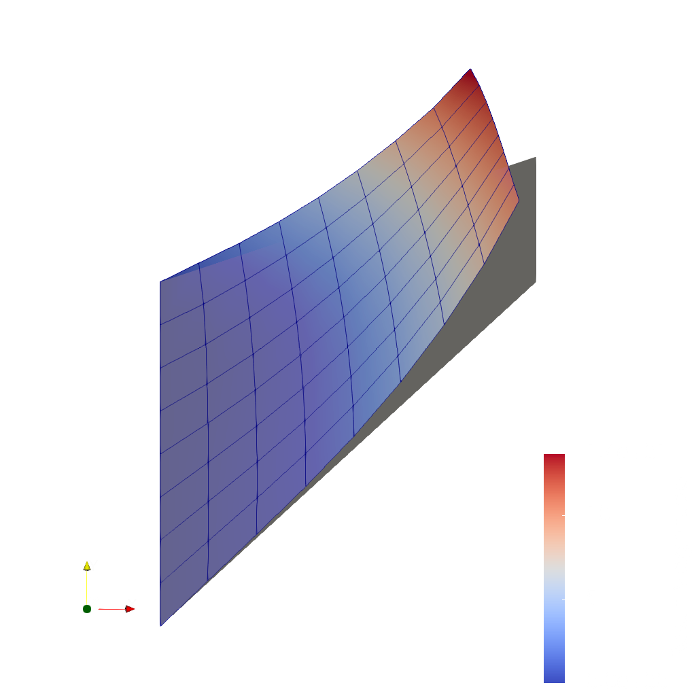

# ℹ️ 04-Elastic_beam

https://github.com/raulinve/Isogeometric-Analysis-with-Deal.II/tree/master/examples/04-Elastic_beam

<br/>  

  

**Img. 1**: Result plot of the *beam* code.  

<br/>  

The following are the steps executed by the **main** function of the *beam* code:

<br/>  

---
### 01. Definition of the main variables:  
- The variables can be passed as program arguments;  
- If no arguments are passed, the default ones are:  
  ```cpp
  char         fe_name[]     = "bernstein";
  char         quad_name[]   = "legendre";
  unsigned int degree        = 2;
  unsigned int n_cycles_down = 0;
  unsigned int n_cycles_up   = 4;
  ```

<br/>  

---
### 02. Initialization of the problem:
The problem is initialized by calling the **constructor** of the problem class:
```cpp
Beam::ElasticProblem<2> elastic_problem_2d(argv[1], argv[2], degree, n_cycles_down, n_cycles_up);
```
Its template is:
```cpp
template <int dim>
ElasticProblem<dim>::ElasticProblem (const std::string  fe_name,
                                     const std::string  quadrature_name,
                                     const unsigned int degree,
                                     const unsigned int n_cycles_low,
                                     const unsigned int n_cycles_up)
```

<br/>  

#### The constructor do the following things:  
1. Initializes all the passed variables;  
2. Specifies the polynomial degree of the finite elements (in this case *NULL*);  
    `fe(NULL),`  
3. Associates the DoFHandler to the triangulation;  
    `dof_handler (triangulation)`  

4. Then the constructor initializes the **quadrature formula**:  
    ```cpp
    if (quadrature_name == "legendre")  {    // <-[default]
      matrix_quad   = QGauss<dim>  (degree+1);
      boundary_quad = QGauss<dim-1>(degree+2);
      error_quad    = QGauss<dim>  (degree+3);
    }
    else if (quadrature_name == "lobatto")  {
      matrix_quad   = QGaussLobatto<dim>  (degree+2);
      boundary_quad = QGaussLobatto<dim-1>(degree+3);
      error_quad    = QGaussLobatto<dim>  (degree+4);
    }
    ```

5. And it also initializes the **FiniteElement** type:  
    ```cpp
    if (fe_name == "bernstein")
      fe = new FESystem<dim>(FE_Bernstein<dim>(degree), dim);
    else if (fe_name == "lagrange")    // <-[default]
      fe = new FESystem<dim>(FE_Q<dim>(degree), dim);
    else if (fe_name == "lobatto")
      fe = new FESystem<dim>(FE_Q<dim>(QGaussLobatto<1>(degree+1)), dim);
    ```
    Note: This initialization at runtime requires to declare the finite element object as a pointer, since it is not known yet at compile time and it does not support assignement operators.  

    Note: Differently with respect to the other examples, this code uses the class `FESystem<dim>` because it has two component (`x` and `y`).  

<br/>  

---
### 03. Solution of the problem:
The problem is solved by calling the **run** method:  
```cpp
elastic_problem_2d.run();
```

<br/>  

#### The run method performs the following actions:  

1. `make_grid();`  
    This method handle the grid creation.  
    Note: This method is invoked only once, when the first cycle runs.  
    The grid is produced with the use of *hyper_cube*:  
    ```cpp
    GridGenerator::hyper_cube(triangulation, -1, 1);
    triangulation.refine_global(n_cycles_low+1);
    ```  
    Note: This method make use of an external function named `grid_y_transform();` which is used to create the actual beam geometry starting from the standard square element.

2. `setup_system();`  
    This method enumerates all the degrees of freedom and sets up matrix and 
    vector objects to hold the system data.  
    For this purpose, a sparse matrix (subdivided in values and pattern structures) is used.  

3. `assemble_system();`  
    This method assemble the matrices and the vector producing the system to solve.  
    The implementation of this method is very similar to the *poisson* code and others. The main difference is the assembly of the RHS vector. In fact, in other codes the rhs is assembled by starting from the definition of the forces on the quadrature nodes, in this code instead, it is assembled directly by enforcing the forces on the nodes of the structure.  
    Note: See the documentation for more details.  

4. `solve();`  
    This method solve the matrix system using the preconditioned Conjugate Gradients (CG) 
    method that can be used to solve linear systems with a symmetric positive definite matrix.  
    ```cpp
    SolverControl             solver_control(100000, 1e-14);
    SolverCG<Vector<double>>  cg(solver_control);

    PreconditionSSOR<SparseMatrix<double>> preconditioner;
    preconditioner.initialize(system_matrix, 1.2);

    cg.solve(system_matrix,  solution,  system_rhs,  preconditioner);
    ```  
    Note: In the majority of deal.ii step codes, the solver controls are `(1000, 1e-12)`.  

5. `output_results(cycle);`  
    This method produces the output drawings in .vtk format.  


