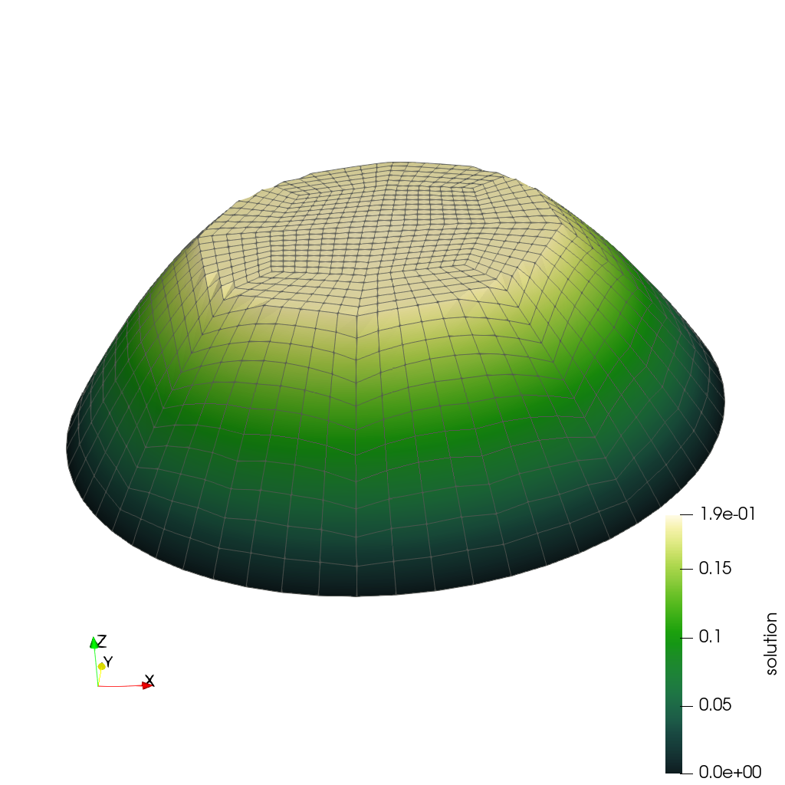

# ℹ️ Step-5 IGA code (extended poisson)

https://github.com/raulinve/Isogeometric-Analysis-with-Deal.II/tree/master/step-05_IGA_(ext_poisson)  

<br/>  

  

**Img. 1**: Result plot of the *step-5 IGA (extended poisson)* code.  

<br/>  

The following are the steps executed by the **main** function of the *step-5 IGA* code:

<br/>  

---
### 01. Definition of the main variables:  
- The variables can be passed as program arguments;  
- If no arguments are passed, the default ones are:  
  ```cpp
  char         fe_name[]     = "bernstein";
  char         quad_name[]   = "legendre";
  unsigned int degree        = 1;
  unsigned int n_cycles_down = 0;
  unsigned int n_cycles_up   = 5;
  ```

<br/>  

---
### 02. Initialization of the problem:
The problem is initialized by calling the **constructor** of the problem class:
```cpp
Step5<2> laplace_problem_2d(argv[1], argv[2], degree, n_cycles_down, n_cycles_up);
```
Its template is:
```cpp
template <int dim>
Step5<dim>::Step5 (const std::string   fe_name,
                   const std::string   quadrature_name,
                   const unsigned int  degree,
                   const unsigned int  n_cycles_low,
                   const unsigned int  n_cycles_up );
```

<br/>  

#### The constructor do the following things:  
1. Initializes all the passed variables;  
2. Specifies the polynomial degree of the finite elements (in this case *NULL*);  
    `fe(NULL),`  
3. Associates the DoFHandler to the triangulation;  
    `dof_handler (triangulation)`  

Note: Until here the code is identical to the original step-5 example 
(exept from the fact that the finite element object "fe" is a pointer).  

4. Then the constructor initializes the **quadrature formula**:  
    ```cpp
    if (quadrature_name == "legendre")  {    // <-[default]
      matrix_quad   = QGauss<dim>  (degree+1);
      boundary_quad = QGauss<dim-1>(degree+2);
      error_quad    = QGauss<dim>  (degree+3);
    }
    else if (quadrature_name == "lobatto")  {
      matrix_quad   = QGaussLobatto<dim>  (degree+2);
      boundary_quad = QGaussLobatto<dim-1>(degree+3);
      error_quad    = QGaussLobatto<dim>  (degree+4);
    }
    ```

5. And it also initializes the **FiniteElement** type:  
    ```cpp
    if (fe_name == "bernstein")
      fe = new FE_Bernstein<dim>(degree);
    else if (fe_name == "lagrange")    // <-[default]
      fe = new FE_Q<dim>(degree);
    else if (fe_name == "lobatto")
      fe = new FE_Q<dim>(QGaussLobatto<1>(degree+1));
    ```
    Note: This initialization at runtime requires to declare the finite element object as a pointer, since it is not known yet at compile time and it does not support assignement operators.  


<br/>  

---
### 03. Solution of the problem:
The problem is solved by calling the **run** method:  
```cpp
  laplace_problem_2d.run();
```

<br/>  

#### The run method performs the following actions:  

1. **Read the grid from file:**
    A series of commands handle the grid creation.  
    Note: This step is performed only once, (it is not repeated in the cycles).  
    The grid is red from the file *circle-grid.inp*.  
    ```cpp
	GridIn<dim> grid_in;
	grid_in.attach_triangulation(triangulation);
	std::ifstream input_file("circle-grid.inp");

	Assert(dim == 2, ExcInternalError());
	grid_in.read_ucd(input_file);

	const SphericalManifold<dim> boundary;
	triangulation.set_all_manifold_ids_on_boundary(0);
	triangulation.set_manifold(0, boundary);
    ```

2. **Grid refinement:**
    On each cycle a library command is used to refine the grid:  
    ```cpp
    triangulation.refine_global (1);
    ```

3. `setup_system();`  
    This method enumerates all the degrees of freedom and sets up matrix and 
    vector objects to hold the system data.  
    For this purpose, a sparse matrix (subdivided in values and pattern structures) is used.  
    The only difference between this code and the original step-5 is the use of `*fe` instead of `fe`.  

4. `assemble_system();`  
    This method assemble the matrices and the vector producing the system to solve.  
    The implementation is very similar between this code and the original step-5.  
    Note: See the documentation for more details.  

5. `solve();`  
    This method solve the matrix system using the preconditioned Conjugate Gradients (CG) 
    method that can be used to solve linear systems with a symmetric positive definite matrix.  
    ```cpp
    SolverControl            solver_control(100000, 1e-14);
    SolverCG<Vector<double>> solver(solver_control);

    PreconditionSSOR<SparseMatrix<double>> preconditioner;
    preconditioner.initialize(system_matrix, 1.2);

    solver.solve(system_matrix, solution, system_rhs, preconditioner);
    ```  
    Note: In the original step-5 code the solver controls were `(1000, 1e-12)`.  

6. `output_results(cycle);`  
    This method produces the output drawings in .vtu format.  


